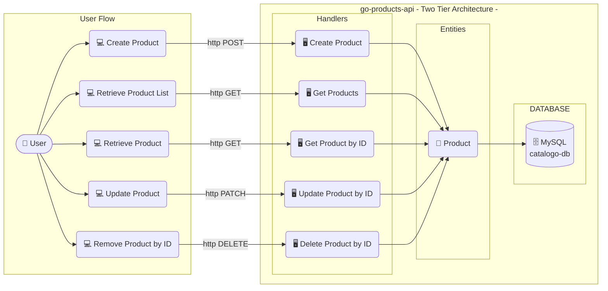
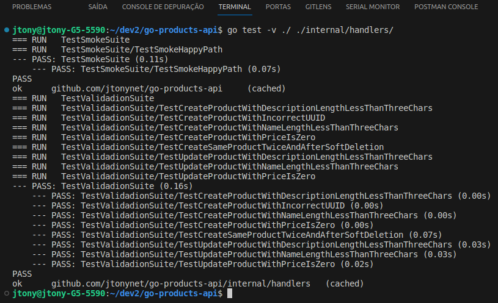
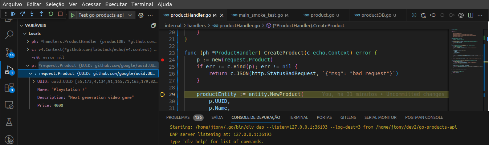

<a id="go-products-api"></a>
<!-- 
    Logo image generated by Bing IA: https://www.bing.com/images/create/
-->


<!-- 
    icons by:
    https://devicon.dev/
    https://simpleicons.org/
-->
[](https://www.postman.com/) [](https://go.dev/) [](https://echo.labstack.com/) [](https://www.mysql.com/) [](https://www.docker.com/) [](https://ubuntu.com/) [](https://github.com/spf13/viper) [](https://github.com/jtonynet) [](https://mermaid.js.org/) [](https://code.visualstudio.com/) [](https://swagger.io/) [](https://docs.github.com/en/actions) <!-- [](https://prometheus.io/) [](https://grafana.com/) [](https://redis.com/) [](https://gatling.com/) [](https://rabbitmq.com/) -->


 [](https://github.com/users/jtonynet/projects/5/views/1)  

---

#### 🕸️ Encontre-me na web:
[](https://www.linkedin.com/in/jos%C3%A9-r-99896a39/) [](https://dev.to/learningenuity) [](mailto:learningenuity@gmail.com) [](https://twitter.com/aromademirtilo) [](https://www.instagram.com/learningenuity) 

---

<a id="index"></a>
## :arrow_heading_up: index

[Go Products API](#go-products-api)<br/>
  1.   :arrow_heading_up: [Índice](#arrow_heading_up-index)
  2.   :green_book: [Sobre](#about)
  3.   :computer: [Rodando o Projeto](#run)
  4.   :newspaper: [Documentação da API](#api-docs)
  5.   :bar_chart: [Diagramas](#diagrams)
  6.   :white_check_mark: [Testes](#tests)
  7.   :beetle: [Debug](#debug)
  8.   :toolbox: [Ferramentas](#tools)
  9.   :clap: [Boas Práticas](#best-practices)
  10.  :brain: [ADR - Architecture Decision Records](#adr)
  11.  :1234: [Versões](#versions)
  12.  :robot: [Uso de AI](#ia)


<!-- 8.  :detective: [Observabilidade](#observability) -->

<br/>

[:arrow_heading_up: de volta ao índice](#index)

---

<a id="about"></a>
## 📗 Sobre:

Este repositório foi criado com a intenção de propor uma possível solução para o seguinte desafio:

> 👨‍💻 __Case Dev Backend:__
> Vamos construir uma API?
> 
> A API a ser desenvolvida deve conter rotas C.R.U.D. de produtos, seguindo um bom design de API.
> - Requisitos:
>   - Rota para criação de produtos.
>   - Rota para consulta de produtos.
>   - Rota para atualização de produtos.
>   - Rota para exclusão de produtos.
> 
> Sinta-se livre para aprimorar a API e demonstrar seus conhecimentos.
>
> - Stack Back-end
>   - Postman
>   - GoLang
>   - Echo Framework
>   - MySQL
>
> - Padrões de qualidade.
>   - API Design
>   - Código Limpo (Clean Code)
>   - Padrões e convenções GoLang

Dada sua simplicidade, uma vez que se trata de um __CRUD simples__. Faz sentido utilizar __Arquitetura de Duas Camadas__ o que aumenta o ritmo do desenvolvimento com menos partes para se preocupar porém mantendo a qualidade do resultado final.

<br/>

[:arrow_heading_up: de volta ao índice](#index)

---

<a id="run"></a>
## 💻 Rodando o Projeto

__TODO__

<br/>

[:arrow_heading_up: de volta ao índice](#index)

---
<a id="api-docs"></a>
## 📰  Documentação da API

####   Swagger docs:


<br/>

__TODO__

<br/>

[:arrow_heading_up: de volta ao índice](#index)

---

<a id="diagrams"></a>
## 📊 Diagramas do Sistema:

<!-- 
    diagrams by:
    https://mermaid.js.org/
-->

_*Diagrama geral com baixo nível de fidelidade_

<br/>

[:arrow_heading_up: de volta ao índice](#index)

---

<a id="tests"></a>
### :white_check_mark: Testes


Para testar localmente, é necessário ter o Go v1.21.1 instalado. Execute o `smoke test`  (mais próximo de um teste de integração) para garantir o funcionamento correto da API e do banco de dados. Inicie o banco de dados na raiz do projeto usando docker-compose.

```bash
docker compose up mysql-go-products-api
```

Em outro terminal mas ainda na raiz do projeto, execute o comando:
```bash
go test -v
```

obtendo uma saida similar a seguinte:<br/>


<br/>

[:arrow_heading_up: de volta ao índice](#index)

---

<a id="debug"></a>
### :beetle: Debug
Utilizando o VSCode como editor de código ([maiores informações aqui](https://code.visualstudio.com/docs/languages/go#_debugging)) com a seguinte configuração no arquivo `.vscode/launch.json`:

```json
{
    "version": "0.2.0",
    "configurations": [
        {
            "name": "Launch go-products-api",
            "type": "go",
            "request": "launch",
            "mode": "debug",
            "program": "${workspaceFolder}/cmd/api/main.go",
            "cwd": "${workspaceFolder}",
            "trace": "verbose",
        },
        {
            "name": "Test go-products-api",
            "type": "go",
            "request": "launch",
            "mode": "test",
            "program":"${workspaceFolder}/main_smoke_test.go",
            "trace": "verbose",
        }
    ]
}
```

Uma seção de Depuração de Testes da aplicação:


<br/>

[:arrow_heading_up: de volta ao índice](#index)

<!--
---

<a id="observability"></a>
## 🕵️ Observabilidade:

__TODO__

[:arrow_heading_up: de volta ao índice](#index)
-->

---

<a id="tools"></a>
## 🧰 Ferramentas

- Language:
  - [Go v1.21.1](https://go.dev/)
  - [GVM v1.0.22](https://github.com/moovweb/gvm)

- Framework & Libs:
  - [Echo](https://echo.labstack.com/)
  - [Testify](github.com/stretchr/testify)
  - [GORM](https://gorm.io/index.html)
  - [Gjson](https://github.com/tidwall/gjson)
  - [Viper](https://github.com/spf13/viper)
  - [uuid](https://github.com/google/uuid)
  - [Delve](https://github.com/go-delve/delve)
<!-- [Client-prometheus](https://github.com/prometheus/client_golang)
  - [GORM Prometheus](https://github.com/go-gorm/prometheus)
  - [Zap log](https://github.com/uber-go/zap) 
  - [Gopsutil]("github.com/shirou/gopsutil)-->

- Infra & Technologies
  - [Docker v24.0.6](https://www.docker.com/)
  - [Docker compose v2.21.0](https://www.docker.com/)
  - [MySQL](https://www.postgresql.org/)
<!-- [Prometheus](https://prometheus.io/docs/guides/go-application)
  - [Grafana](https://grafana.com/) -->


- GUIs:
  - [VsCode](https://code.visualstudio.com/)
  - [Postman](https://blog.postman.com/introducing-the-postman-vs-code-extension/)
  - [DBeaver](https://dbeaver.io/)

<br/>

[:arrow_heading_up: de volta ao índice](#index)

---

<a id="best-practices"></a>
## 👏 Boas Práticas

- [Swagger](https://swagger.io/)
- [Layout padrão de projetos em Go](https://github.com/golang-standards/project-layout/blob/master/README_ptBR.md)
- [Conventional Commits](https://www.conventionalcommits.org/en/v1.0.0/)
- [Keep a Changelog](https://keepachangelog.com/en/1.0.0/)
- [ADR - Architecture Decision Records](https://cognitect.com/blog/2011/11/15/documenting-architecture-decisions)
- [Mermaid Diagrams](https://mermaid.js.org)
<!-- [Observability](https://en.wikipedia.org/wiki/Observability_(software)) com:
  - [Prometheus](https://prometheus.io/docs/guides/go-application/)
  - [Grafana](https://grafana.com/) -->

<br/>

[:arrow_heading_up: de volta ao índice](#index)

---

<a id="adr"></a> 
## 🧠 ADR - Architecture Decision Records:

- [0001: Registro de Decisões de Arquitetura (ADR)](./docs/architecture/decisions/0001-registro-de-decisoes-de-arquitetura.md)
- [0002: Echo, Gorm e MySQL em API TDD com Arquitetura de Duas camadas](./docs/architecture/decisions/0002-echo-gorm-e-mysql-com-arquitetura-de-api-tdd-em-duas-camadas.md)


<br/>

[:arrow_heading_up: de volta ao índice](#index)

---

<a id="versions"></a>
## 🔢 Versões:

As tags de versões estão sendo criadas manualmente a medida que o projeto avança com melhorias notáveis. Cada funcionalidade é desenvolvida em uma branch a parte (Branch Based, [feature branch](https://www.atlassian.com/git/tutorials/comparing-workflows/feature-branch-workflow)) quando finalizadas é gerada tag e mergeadas em master.

Para obter mais informações, consulte o [Histórico de Versões](./CHANGELOG.md).

<br/>

[:arrow_heading_up: de volta ao índice](#index)

---

<a id="ia"></a>
### 🤖 Use of AI:

A [imagem do cabeçalho](#go-products-api) desta página foi criada com o auxílio de inteligência artificial e um mínimo de retoque e construção no Gimp [](https://www.gimp.org/)

__Foi utilizado os seguinte prompt para sua criação no [Bing IA:](https://www.bing.com/images/create/)__

<details>
  <summary><b>Gopher com carrinho de compras</b></summary>
<i>"gopher azul, simbolo da linguagem golang, empurrando um carinho de compras com caixas escrito REST, API, ECHO e Swagger dentro desse carrinho, estilo cartoon, historia em quadrinhos, fundo branco chapado para facilitar remoção"<b>(sic)</b></i>
</details>

<br/>

IA também é utilizada em minhas pesquisas e estudos como ferramenta de apoio; no entanto, __artes e desenvolvimento são, sobretudo, atividades criativas humanas.__

Contrate artistas para projetos comerciais ou mais elaborados e Aprenda Engenhosidade!

<br/>

[:arrow_heading_up: de volta ao índice](#index)
